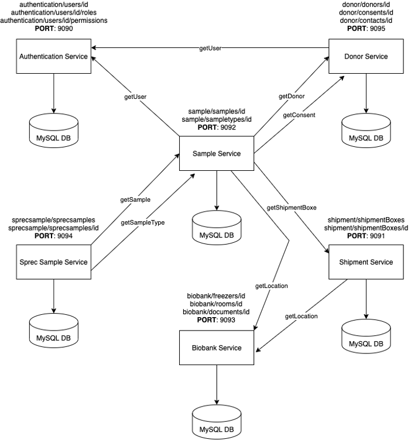
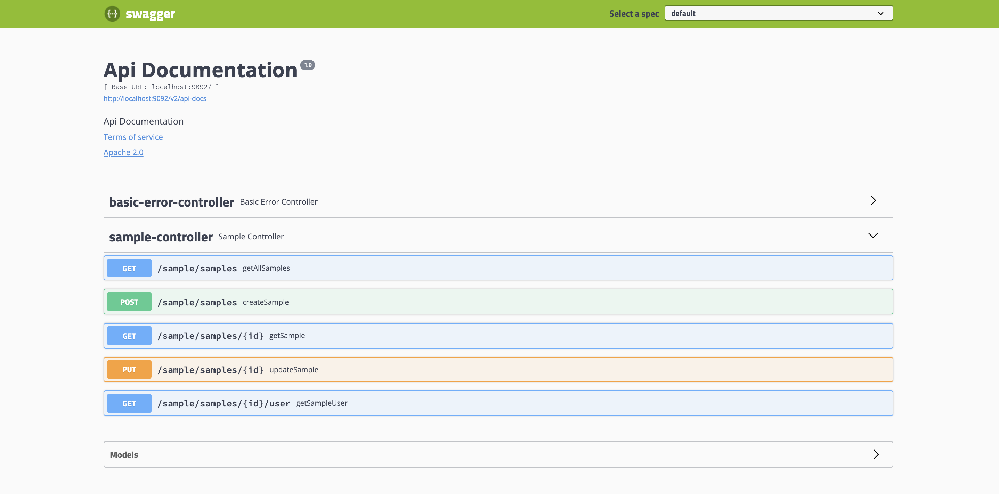
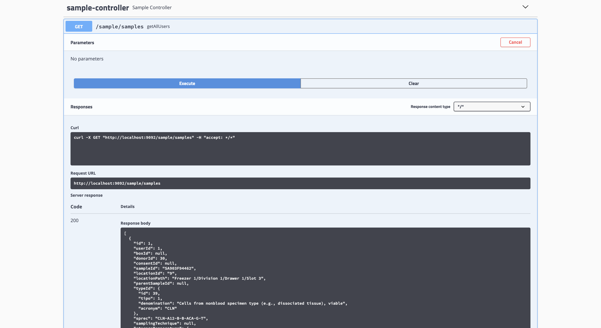

# BiobankSPREC

Execute `docker-compose up`

## Alcune API per Servizio:

* **Biobank http://localhost:9093/biobank/**
  - Visualizza tutti i freezers: http://localhost:9093/biobank/freezers/
  - Visualizza un freezer dato l'id: http://localhost:9093/biobank/freezers/1
  - Visualizza tutte le rooms: http://localhost:9093/biobank/rooms/1

* **Donor http://localhost:9095/donor/**
  - Visualizza tutti i donatori: http://localhost:9095/donor/donors/
  - Visualizza un donatore dato l'id: http://localhost:9095/donor/donors/13
  - Visualizza tutti consensi: http://localhost:9095/donor/consents/

* **Sample http://localhost:9092/sample/**
  - Visualizza tutti i campioni biologici: http://localhost:9092/sample/samples/
  - Visualizza un campione biologico dato l'id: http://localhost:9092/sample/samples/1
  - Aggiornamento del campo boxId di un dato campione: http://localhost:9092/sample/samples/1/?boxId=3 [PUT]
  - Creazione di un campione biologico: http://localhost:9092/sample/samples/ [POST]
    -  **Payload**
     - ```{ "userId": "1", "sampleId": "sample-example", "locationId": "1","donorId":"13", "consentId":"1","typeId": {"id":"20"} }```

* **Shipment http://localhost:9091/shipment/**
  - Visualizza tutti i box delle spedizioni: http://localhost:9091/shipment/shipmentsBoxes/
  - Visualizza un box della spedizione dato l'id: http://localhost:9091/shipment/shipmentsBoxes/1
  - Creazione di una spedizione relativa ad un campione specifico: http://localhost:9091/shipment/shipmentsBoxes/?sampleId=1 [POST]
    -  **Payload**
     - ```{ "boxId": "example-box", "locationId": 9, "name": "example-name", "shipmentId": {"id": 1}, "statusId": {"id": 1} }```

* **SprecSample http://localhost:9094/sprecsample/**
  - Visualizza tutti i campioni biologici con le informazioni pre-analitiche: http://localhost:9094/sprecsample/sprecSamples/
  - Visualizza un campione biologico con le informazioni pre-analitiche dato l'id: http://localhost:9094/sprecsample/sprecSamples/1

## Architettura



## Documentazione API (Swagger 2)

* **Biobank: http://localhost:9093/swagger-ui.html**

* **Donor: http://localhost:9095/swagger-ui.html**

* **Sample: http://localhost:9092/swagger-ui.html**

* **Shipment: http://localhost:9091/swagger-ui.html**

* **SprecSample: http://localhost:9094/swagger-ui.html**

## Swagger UI

* API DOCUMENTATION



Si possono inoltre testare le API, come mostrato in questo esempio per `GET sample/samples/`:


